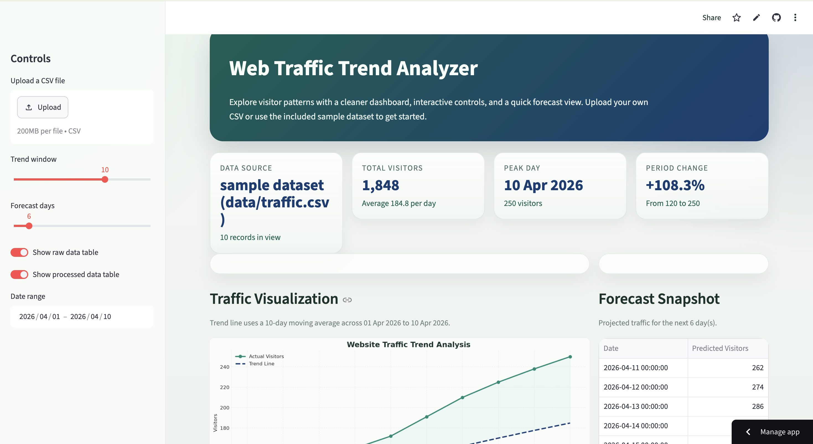
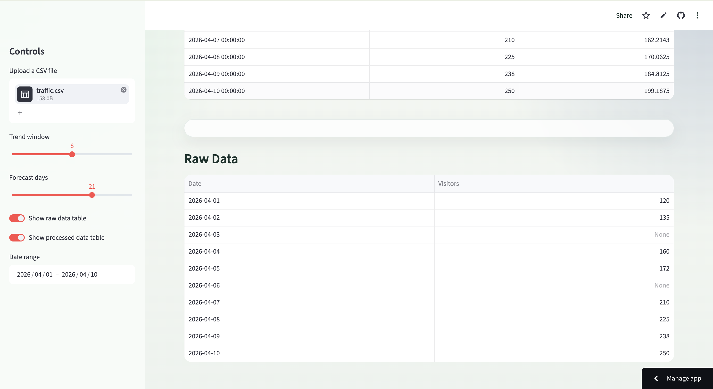
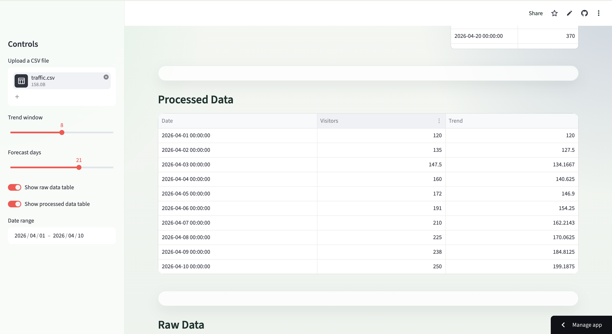
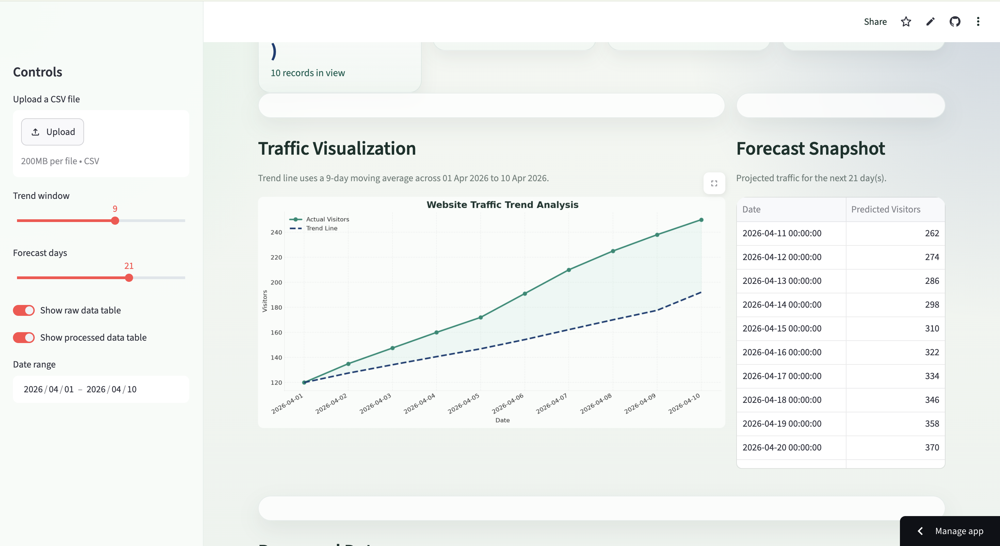

# 🌐 Web Traffic Trend Analyzer

A Python-based web traffic analysis project that processes website visitor data, handles missing values using linear interpolation, analyzes traffic trends using a moving average, visualizes the results, and provides simple future traffic estimation through an interactive Streamlit dashboard.

## 🔗 Project Links

* 🌐 **Live Application:** [Web Traffic Trend Analyzer](https://monika-singh-baghel-traffic-analyser-app-6chc6n.streamlit.app/)
* 💻 **GitHub Repository:** [Traffic-Analyser](https://github.com/monika-singh-baghel/Traffic-Analyser)

## 🎯 Objectives

* Analyze website traffic data over time.
* Handle missing visitor values.
* Use linear interpolation to estimate missing data.
* Calculate a moving average to identify traffic trends.
* Visualize actual traffic and trend data.
* Provide simple future traffic estimation.
* Present the results through an interactive Streamlit dashboard.

## ✨ Features

* 📂 CSV file upload
* 🧹 Data preprocessing
* 🔎 Missing value detection
* 📐 Linear interpolation
* 📈 Moving average calculation
* 📊 Traffic visualization
* 🔮 Future traffic estimation
* 🌐 Interactive Streamlit dashboard

## 🛠️ Technologies Used

| Technology | Purpose                            |
| ---------- | ---------------------------------- |
| Python     | Main programming language          |
| Pandas     | Data loading and data manipulation |
| NumPy      | Numerical computation              |
| Matplotlib | Data visualization                 |
| Streamlit  | Interactive web application        |
| CSV        | Input dataset format               |

## 📐 Numerical Method Used

### Linear Interpolation

Linear interpolation is used to estimate missing visitor values between known data points.

If a visitor value is missing between two known values, the project estimates the missing value based on the linear relationship between the surrounding known values.

For example:

```text
Day 1 → 120 visitors
Day 2 → 150 visitors
Day 3 → Missing
Day 4 → 200 visitors
```

The missing value is estimated using linear interpolation before performing further analysis.

## 📈 Trend Analysis

The project uses a **3-day moving average** to identify the overall traffic trend.

A moving average smooths short-term fluctuations in the data and makes the general traffic pattern easier to understand.

The dashboard displays:

* Actual Traffic
* Moving Average / Trend

## 🔮 Future Traffic Estimation

The project provides a simple estimation of future website traffic.

The current implementation uses the latest traffic value and generates estimated visitor values for the next 5 days.

> **Note:** This is a simple estimation method and is not a machine-learning forecasting model.

## 📂 Input Dataset

The application accepts a CSV file containing two columns:

```csv
Date,Visitors
2026-01-01,120
2026-01-02,150
2026-01-03,
2026-01-04,200
2026-01-05,
2026-01-06,250
```

### Input Columns

| Column     | Description                |
| ---------- | -------------------------- |
| `Date`     | Date of the traffic record |
| `Visitors` | Number of website visitors |

Missing values in the `Visitors` column are handled using linear interpolation.

## 🔄 Project Workflow

```mermaid
flowchart LR
    A["📂 Traffic CSV"] --> B["📥 Data Loading"]
    B --> C["🧹 Preprocessing"]
    C --> D["📅 Date Conversion"]
    D --> E["🔎 Missing Data Detection"]
    E --> F["📐 Linear Interpolation"]
    F --> G["📊 Clean Traffic Data"]
    G --> H["📈 Moving Average"]
    H --> I["📉 Trend Identification"]
    I --> J["📊 Visualization"]
    J --> K["🔮 Future Estimation"]
    K --> L["🌐 Streamlit Dashboard"]
```



## 📊 Application Output

The application provides:

1. **Raw Data** – Displays the uploaded CSV data.
2. **Processed Data** – Displays the cleaned data after preprocessing and interpolation.
3. **Traffic Graph** – Shows actual visitor traffic and the moving-average trend.
4. **Future Prediction** – Shows estimated traffic for the next 5 days.

## 📸 Project Screenshots

### 🏠 Dashboard



### 📂 Raw Data



### 🧹 Processed Data



### 📈 Traffic Graph & Future Prediction



## 📁 Project Structure

```text
Traffic-Analyser/
│
├── 📁 data/
│   └── traffic.csv
│
├── 📁 images/
│   ├── dashboard.png
│   ├── raw-data.png
│   ├── processed-data.png
│   └── graph-future.png
│
├── 📁 src/
│   ├── __init__.py
│   ├── data_loader.py
│   ├── preprocessing.py
│   ├── analysis.py
│   └── visualization.py
│
├── app.py
├── requirements.txt
└── README.md
```

## ⚙️ Installation

### 1. Clone the Repository

```bash
git clone https://github.com/monika-singh-baghel/Traffic-Analyser.git
```

### 2. Open the Project Folder

```bash
cd Traffic-Analyser
```

### 3. Install Required Libraries

```bash
pip install -r requirements.txt
```

### 4. Run the Streamlit Application

```bash
python -m streamlit run app.py
```

The application will open in your web browser.

## ▶️ How to Use

1. Open the Streamlit application.
2. Click on **Upload CSV File**.
3. Select a CSV file containing `Date` and `Visitors`.
4. View the uploaded raw data.
5. The application preprocesses the data.
6. Missing visitor values are filled using linear interpolation.
7. The moving average is calculated.
8. The traffic graph displays actual traffic and the trend.
9. Future traffic estimates for the next 5 days are displayed.

## 🚀 Future Improvements

* Use machine-learning models for more accurate traffic forecasting.
* Add real-time website traffic data.
* Improve dashboard functionality.

## 👩‍💻 Author

**Monika Singh Baghel**

Web Traffic Trend Analyzer — Python Project
